# 01. Introduction & Extension Architecture

Welcome to the **Run Payments with Razorpay** Firebase Extension. This developer-focused documentation suite provides a deep dive into the architecture, configuration, integration, and security of this extension.

This extension simplifies the integration of Razorpay payments into your Firebase applications. It synchronizes Razorpay Customers, Plans, Subscriptions, and Payments to Cloud Firestore in real-time, allowing you to build subscription and checkout flows with minimal backend code.

---

## 🏆 Key Features

*   🔄 **Automatic Customer Sync**: Seamlessly creates a Razorpay Customer when a new user signs up via Firebase Authentication.
*   🛒 **One-Time Checkout Sessions**: Trigger secure, catalog-driven, tampered-proof Razorpay Orders by writing checkout session documents directly from your frontend.
*   💳 **Recurring Subscriptions**: Leverage Razorpay's robust recurring billing engine to offer multi-tier plans with simple Firestore writes.
*   ⚡ **Real-Time Webhook Synchronization**: Automatically maps Razorpay payment and subscription lifecycle updates back into Firestore documents.
*   🔒 **Idempotent Processing**: Employs rigorous gRPC transaction locks, unique document constraints, and signature verification to guard against duplicate operations, race conditions, and replay attacks.
*   🛡️ **Role-Based Access Control (RBAC)**: Automatically synchronizes Firebase Auth custom user claims with roles corresponding to their active subscriptions.
*   📢 **Eventarc Notifications**: Publishes key checkout and subscription events directly to Eventarc, allowing you to plug in custom backend business logic.

---

## 📊 Extension Architecture

The diagram below illustrates the comprehensive visual flow of operations across client interfaces, Cloud Firestore collections, Cloud Functions (triggers and callables), and the external Razorpay platform.

```mermaid
flowchart TB
    %% Nodes
    subgraph Client ["Client Application"]
        UI["User Interface (Web/Mobile)"]
        SDK["Razorpay Checkout SDK"]
    end

    subgraph Firebase ["Firebase / Google Cloud Project"]
        subgraph Auth ["Firebase Authentication"]
            Users["User Records & Custom Claims"]
        end

        subgraph Functions ["Cloud Functions for Firebase"]
            F_Cust["createCustomer (Auth Trigger)"]
            F_Ord["createOrder (Firestore Trigger)"]
            F_Sub["createSubscription (Firestore Trigger)"]
            F_Web["razorpayWebhookHandler (HTTPS Webhook)"]
            
            subgraph Callables ["Firebase Callables"]
                C_Cancel["cancelSubscription"]
                C_Update["updateSubscriptionPlan"]
                C_Sync["syncPlans (Admin Only)"]
                C_Plan["createPlan (Admin Only)"]
            end
        end

        subgraph Firestore ["Cloud Firestore Database"]
            Col_Cust["/customers/{uid} (Customer Details)"]
            Col_Sess["/customers/{uid}/checkout_sessions/{id}"]
            Col_Subs["/customers/{uid}/subscriptions/{id}"]
            Col_Prod["/products/{id} (Catalog & Synced Plans)"]
            Col_Evt["/webhook_events/{id} (Idempotency Logs)"]
        end

        Eventarc["Eventarc (Custom Event Publishing)"]
    end

    subgraph RazorpayAPI ["Razorpay API Gateway"]
        RZP_Cust["Razorpay Customers"]
        RZP_Ord["Razorpay Orders"]
        RZP_Plan["Razorpay Plans"]
        RZP_Subs["Razorpay Subscriptions"]
    end

    %% Auth Flows
    Users -->|Triggers User Creation| F_Cust
    F_Cust -->|Creates Customer via REST| RZP_Cust
    RZP_Cust -->|Returns Customer ID| F_Cust
    F_Cust -->|Saves razorpay_customer_id| Col_Cust

    %% One-Time Payment Flows
    UI -->|1. Creates Session Document| Col_Sess
    Col_Sess -->|2. Document Created Trigger| F_Ord
    F_Ord -->|3. Fetches Product Amount| Col_Prod
    F_Ord -->|4. Checks existing / Creates Order| RZP_Ord
    RZP_Ord -->|5. Returns Order ID| F_Ord
    F_Ord -->|6. Writes order_id & status: created| Col_Sess
    Col_Sess -->|7. Reads order_id| UI
    UI -->|8. Opens Checkout Dialog| SDK
    SDK -->|9. Processes Payment| RazorpayAPI

    %% Subscription Flows
    UI -->|1. Creates Subscription Document| Col_Subs
    Col_Subs -->|2. Document Created Trigger| F_Sub
    F_Sub -->|3. Resolves secure planId| Col_Prod
    F_Sub -->|4. Requests Subscription Creation| RZP_Subs
    RZP_Subs -->|5. Returns subscription_id & url| F_Sub
    F_Sub -->|6. Writes subscription_id & status| Col_Subs
    Col_Subs -->|7. Reads short_url for redirect| UI

    %% Webhook Sync Flow
    RazorpayAPI -.->|Async HTTP Post Event| F_Web
    F_Web -->|1. Verifies Signature & Atomic Lock| Col_Evt
    F_Web -->|2. Processes Event payload| F_Web
    
    F_Web -->|3a. Syncs Payments & Sessions| Col_Sess
    F_Web -->|3b. Syncs Subscription State| Col_Subs
    F_Web -->|3c. Synced Subscriptions Subcollection Payments| Col_Subs
    
    F_Web -->|4. If Active, grants claims| Users
    F_Web -->|5. Publishes Custom Event| Eventarc

    %% Callables Flow
    UI -->|Call function| C_Cancel
    C_Cancel -->|Cancel Subscription API| RZP_Subs
    RZP_Subs -->|Returns Cancelled Status| C_Cancel
    C_Cancel -->|Updates status: cancelled| Col_Subs

    UI -->|Call function| C_Update
    C_Update -->|Update Subscription Plan API| RZP_Subs
    RZP_Subs -->|Returns Updated Status| C_Update
    C_Update -->|Updates plan_id & status| Col_Subs
```

---

## ⚡ Next Steps

To begin using the extension, proceed to **[02. Installation & Local Emulator Setup](./02-installation.md)** to configure your environment variables, deploy the extension, and configure your local Firestore emulator.
