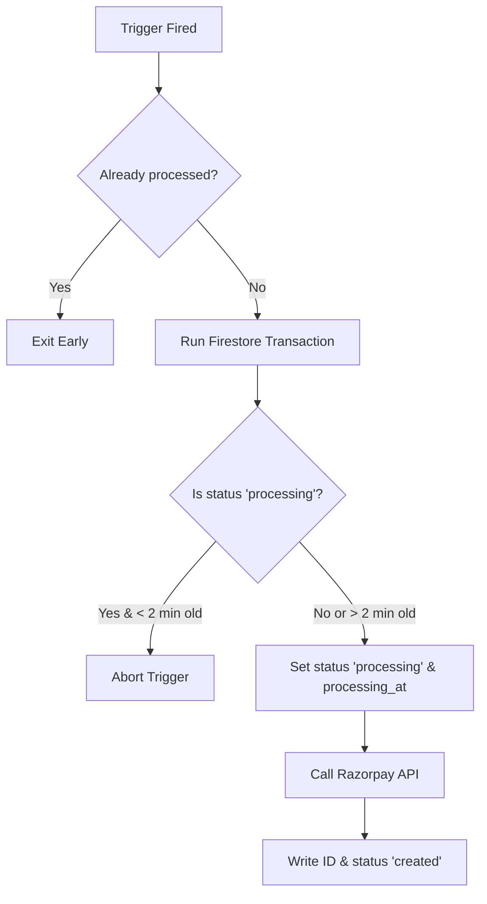

# 06. Idempotency & Concurrency Management

In cloud billing integrations, network failures, slow database calls, rapid client-side clicks, and multiple function invocations are inevitable. If not handled with high architectural precision, this can lead to double charges, duplicate subscriptions, and mismatched databases.

This extension features a **multi-layered, production-grade idempotency and fault-tolerance system** to guarantee that every payment and webhook event is processed exactly once.

---

## 🔒 1. Webhook Replay & Deduplication Layer

Every incoming webhook event has a unique ID (provided in the `x-razorpay-event-id` header or inside the JSON payload). To prevent double-processing or replay attacks, the extension uses a dedicated **deduplication table** in Firestore.

### 🔄 Idempotency Webhook Lock Flow

Before any handler logic executes, the webhook function attempts to write an atomic document to the `webhook_events` collection using the event ID:

```typescript
const eventId = req.headers['x-razorpay-event-id'] || event.id;
const webhookEventRef = db.collection('webhook_events').doc(eventId);

try {
    // Attempt to write the lock document atomically
    await webhookEventRef.create({
        event: event.event,
        processed_at: FieldValue.serverTimestamp(),
    });
} catch (e: any) {
    if (e.code === 6) { // ALREADY_EXISTS (gRPC Status Code 6)
        logs.info(`Webhook event ${eventId} already processed. Skipping.`);
        res.status(200).send('Already Processed');
        return;
    }
    // Handle other database connection failures
    res.status(500).send('Database lookup failed');
    return;
}
```

*   **Why `.create()`?** In Firestore, `.create()` fails with an `ALREADY_EXISTS` error if the document is present. This is an **atomic transaction** run at the database level.
*   **The Result**: If a webhook event is sent multiple times due to a Razorpay retry or network hiccup, subsequent requests hit the `ALREADY_EXISTS` catch block and exit immediately without modifying user subscriptions or balances.

---

## 🛠️ 2. Resilient Failure Recovery & Retry Logic

When processing a webhook, code execution can fail due to three categories of errors. The extension handles each dynamically to ensure maximum uptime:

### A. Transient / Database Failures (Retryable)
If the function encounters a temporary network issue, Firestore timeout, or gRPC deadline exceeded:
1.  **Delete the Webhook Lock**: The function deletes the lock document from the `webhook_events` collection.
2.  **Return a `500 Internal Server Error`**: Tells Razorpay that the delivery failed, allowing Razorpay's scheduler to retry sending the webhook later using exponential backoff.

### B. Logical / Permanent Failures (Non-Retryable)
If the function fails due to an invalid configuration or programming bug:
1.  **Keep the Webhook Lock**: The lock remains in `webhook_events`.
2.  **Return a `200 OK`**: Prevents Razorpay from retrying infinitely (which wastes computing resources and fills up cloud functions execution queues).
3.  **Critical Logging**: Emits a prominent log entry:
    `PERMANENT WEBHOOK FAILURE — event will NOT be retried. Manual investigation required.`

---

## ⚡ 3. Concurrency Locks Inside Triggers

When users trigger checkouts or subscriptions, rapid double-clicks or browser retries can execute multiple triggers simultaneously. To prevent duplicate orders or subscriptions on Razorpay, both `createOrder` and `createSubscription` utilize **Firestore transactions** to implement a lease lock.



### 🕒 The 2-Minute Zombie Lock Escape Hatch

If a Cloud Function crashes or times out while invoking the Razorpay API, the Firestore session document might get permanently stuck under `status: 'processing'`.

To prevent locking users out of checking out again, the transaction includes a **2-minute lease duration**:

```typescript
if (txData.status === 'processing') {
    const processingAt = txData.processing_at?.toDate();
    // If locked less than 2 minutes ago, abort and let the active function finish.
    if (processingAt && (Date.now() - processingAt.getTime()) < 120000) {
        shouldProcess = false;
        return;
    }
}
```

If the document has been in `processing` for more than 2 minutes, it assumes a crash happened, overrides the lock, and safely retries the Razorpay API call.

---

## 💳 4. Receipt-Based Double Payment Prevention

Even with concurrency locks, a request can sometimes be successfully processed by Razorpay, but the server response drops before saving the Order ID to Firestore.

To handle this, when the trigger wakes up, it uses the Firestore Checkout Session ID as a **Receipt Parameter** to query the Razorpay API before calling the creation endpoint:

```typescript
const receipt = sessionId.substring(0, 40);
const existingOrders = await razorpay.orders.all({ receipt });

const matchingOrder = existingOrders?.items?.find(o => o.receipt === receipt);
if (matchingOrder) {
    // REUSE the existing order rather than creating a duplicate on Razorpay
    order = matchingOrder;
} else {
    order = await razorpay.orders.create({ ... });
}
```

---

## ⚡ Next Steps

For production readiness, proceed to **[07. Firestore Security Rules](./07-security-rules.md)** to secure your data fields from unauthorized client reads and writes.
